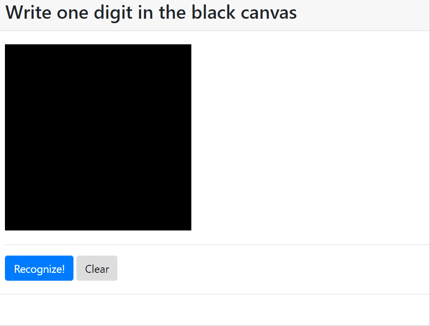

# Handwritten Digits Recognition Using CNN in Keras
 
Trained a model on [MNIST handwritten digit database](http://yann.lecun.com/exdb/mnist/) using CS231N in Keras.

Also implemented a GUI app to allow users to draw their own digit to test the model.


## Training App

### requirements

```
numpy
tensorflow
keras
```

### run training

1. Edit the config in `training_app/config.py` if necessary
1. Run `digitrecognition.py`

### result

0.9862 accuracy in 3 epochs

## GUI Inference App

By utilizing trained model, we can predict given any images
Here is an simple GUI application implemented in Django, which allows you draw a digit and run the prediction.

### requirements

```
numpy
tensorflow
keras
pillow
django
```

### run inference app

1. cd to `gui_inference_app`
2. make sure packages are installed correctly
3. `python manage.py runserver`
4. Open `http://127.0.0.1:8000` in your browser

### Demo


